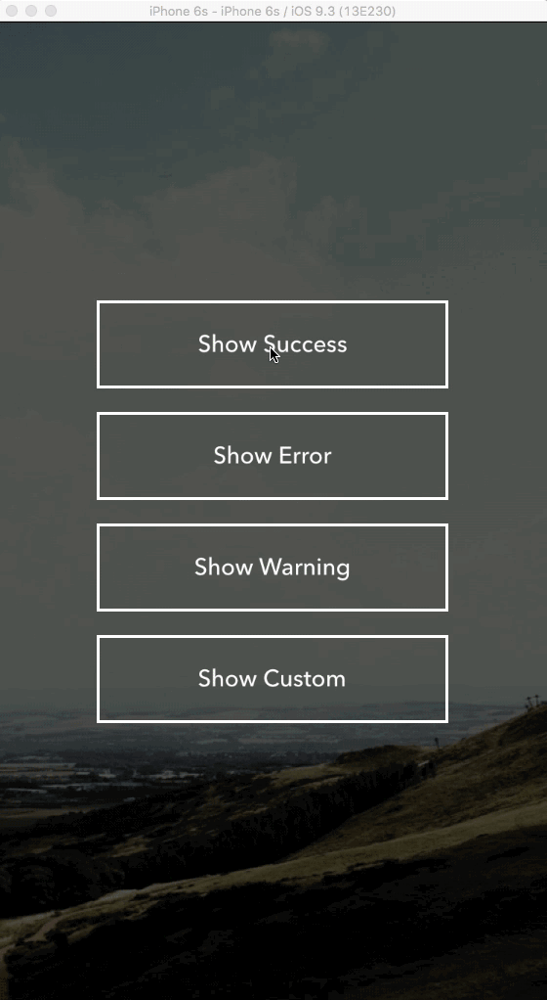
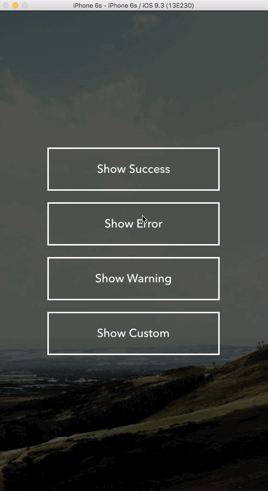
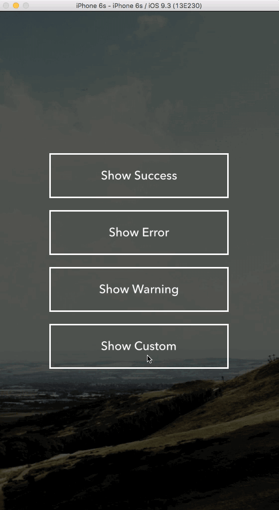

<p align="center">
  
</p>

<p align="center">
    
    <a href="https://developer.apple.com/swift"></a>
    <a href="https://cocoapods.org/pods/JHDropdown"></a>
     <br><br>
</p>






## Installation
1. Manually add files to your XCode Project
2. Install using CocoaPods

JHDropdown is now available on [CocoaPods](http://cocoapods.org). Simply add the following to your project Podfile and install
```ruby
platform :ios, '8.0'
use_frameworks!

pod 'JHDropdown'
```

## Usage

Call Dropdown.show(_:) when you want to show the notification  

```swift
Dropdown.show("Set a message for the dropdown here", state: .Success, duration: 2.0, action: nil)
```

Customize the dropdown by using the .Custom DropdownState

```swift
let yourImage = UIImage(named: "yourimage")
let color = UIColor.anyColor()

Dropdown.show("Set a message for the dropdown here", state: .Custom(yourColor, yourImage), duration: 2.0, action: nil)
```

Run code after the animation for the dropdown is complete

```swift
Dropdown.show("Set a message for the dropdown here", state: .Error, duration: 2.0) {
  // this code will run once animation is complete
}
```

## 📝 To Do List 
* Add 3D animations to JHDropdown
* Add Carthage Installation support

## Author

Justin Hall: @ohthatsjhall

## License

JHDropdown is released under the MIT license. See LICENSE for details.

